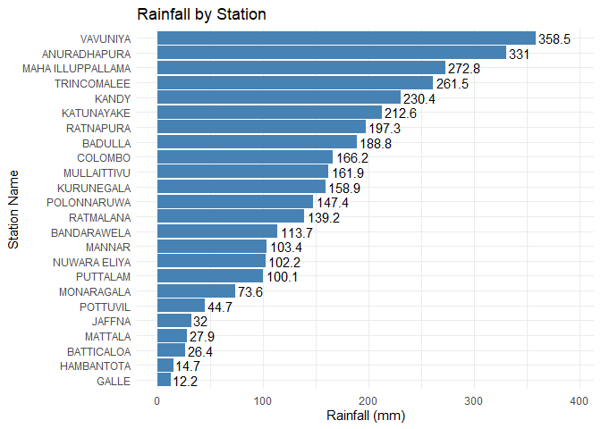

<!-- README.md is generated from README.Rmd. Please edit that file -->

# Ditwah

<!-- badges: start -->

<!-- badges: end -->

The Dithwa storm that hit Sri Lanka on November 28, 2025, led to this
package, which focuses on data, monitoring, and early warning.

## Installation

You can install the development version of Ditwah from
[GitHub](https://github.com/) with:

``` r
# install.packages("pak")
pak::pak("thiyangt/Ditwah")
```

## Load Data 3 Hour Weather Data

``` r
library(Ditwah)
head(ditwah_3hr_weather_data)
#>   Station_ID      Station_Name         Report_Time Rainfall_mm Temperature_C
#> 1      43404            JAFFNA 2025-11-28 08:30:00        32.0          24.0
#> 2      43413            MANNAR 2025-11-28 08:30:00       103.4          24.3
#> 3      43415          VAVUNIYA 2025-11-28 08:30:00       358.5          23.8
#> 4      43418       TRINCOMALEE 2025-11-28 08:30:00       261.5          24.6
#> 5      43421      ANURADHAPURA 2025-11-28 08:30:00       331.0          21.4
#> 6      43422 MAHA ILLUPPALLAMA 2025-11-28 08:30:00       272.8          22.0
#>   RH_% report
#> 1  100      1
#> 2   95      1
#> 3   98      1
#> 4   99      1
#> 5  100      1
#> 6   99      1
```

## Data Visualisation



This package was developed for educational purposes using three-hourly
weather data recorded by the Department of Meteorology, Sri Lanka
(<https://meteo.gov.lk/> )

## Flood Level Data

    #> # A tibble: 6 × 15
    #>   Report_Date Report_Time         `River Basin`           Tributory_River
    #>   <chr>       <dttm>              <chr>                   <chr>          
    #> 1 28-11-2025  2025-11-28 09:30:00 "Kelani Ganga\r(RB 01)" Kelani Ganga   
    #> 2 28-11-2025  2025-11-28 09:30:00 "Kelani Ganga\r(RB 01)" Kelani Ganga   
    #> 3 28-11-2026  2025-11-28 09:30:00 "Kelani Ganga\r(RB 01)" Kelani Ganga   
    #> 4 28-11-2026  2025-11-28 09:30:00 "Kelani Ganga\r(RB 01)" Kelani Ganga   
    #> 5 28-11-2028  2025-11-28 09:30:00 "Kelani Ganga\r(RB 01)" Kelani Ganga   
    #> 6 28-11-2028  2025-11-28 09:30:00 "Kelani Ganga\r(RB 01)" Kelani Ganga   
    #> # ℹ 11 more variables: `Gauging Station` <chr>, Unit <chr>, AlertLevel <dbl>,
    #> #   MinorFloodLevel <dbl>, MajorFloodLevel <dbl>, Remarks <chr>,
    #> #   WaterLevelRising_or_Falling <chr>, Water_Level_Time <chr>,
    #> #   `Water Level` <dbl>, RFmm <dbl>, RFmm_measured_at <chr>
